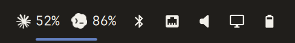
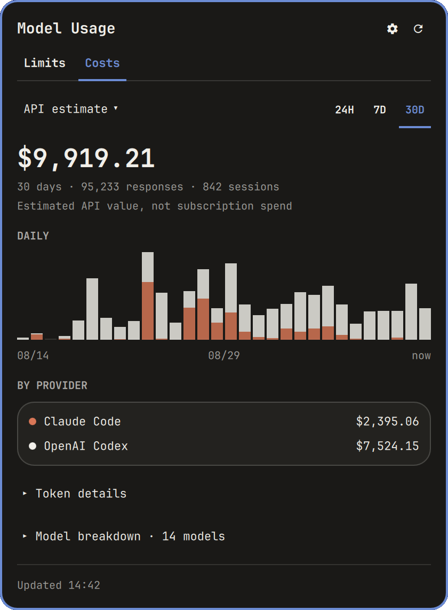
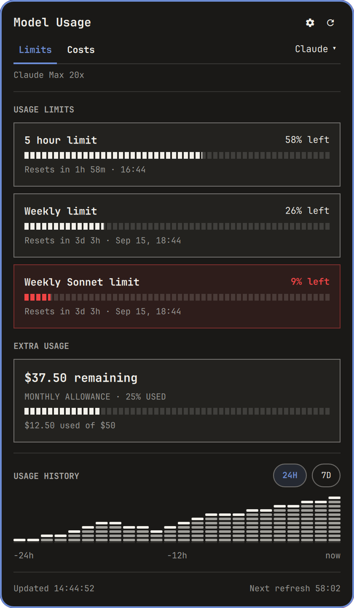

# Model Usage for Omarchy

[](https://github.com/DigitalPals/omarchy-modelusage/actions/workflows/ci.yml)

AI subscription limits, token activity, and estimated API costs in your Omarchy menu bar. Monitor **Claude Code, OpenAI Codex, and Kimi Code** through local CLI sign-ins or accounts managed by [CLIProxyAPI](https://github.com/router-for-me/CLIProxyAPI).

<p align="center">
  
</p>

<table>
  <tr>
    <th>Three Codex subscriptions · CLIProxyAPI</th>
    <th>Costs · local CLI + remote T3 history</th>
  </tr>
  <tr>
    <td valign="top"></td>
    <td valign="top"></td>
  </tr>
</table>

Cropped captures of the running widget, September 2026. Account emails are hidden.

## Highlights

- **Multiple subscriptions:** CLIProxyAPI discovers managed accounts automatically. Each account gets its own quota card, plan, reset time, and supported credits. Codex banked resets can be reviewed and applied with confirmation.
- **Usage at a glance:** compact provider percentages, configurable bar visibility, reset countdowns, warning colors, and persistent 24H/7D quota history. Optional [CPA Usage Keeper](docs/keeper-deployment.md) activity identifies the last-used proxy account in the bar.
- **Combined cost history:** local Codex/Claude transcripts and up to four [T3 Code](https://github.com/pingdotgg/t3code) servers in one 24H/7D/30D view, with API estimates, tokens, and provider/model breakdowns.
- **Improved accounting:** common pricing across sources, cache-aware token costs, shared-folder deduplication, corrected handling of equal-sized Codex responses, custom model rates, and incremental scans.
- **Cleaner UI:** Limits/Costs tabs, a compact provider menu, expandable details, separate quota and cost settings, fixed Save/Cancel controls, and square usage cards with a theme-corner option. Keyboard navigation and Omarchy theme/scaling support are built in.

See the [changelog](CHANGELOG.md) for the complete update history.

## Install

Requires **Omarchy Quattro with schema-v1 shell plugins**, **Python 3.10+**, and a signed-in supported CLI or configured CLIProxyAPI server. Python backends use only the standard library. Quota checks need network access; Costs can fetch the public LiteLLM price table and contact configured T3 servers.

Validated on Omarchy **4.0.3**, Quickshell **0.3.1**, and Qt **6.11.2**. See [compatibility](COMPATIBILITY.md) for exact revisions and provider coverage.

```bash
omarchy plugin add https://github.com/DigitalPals/omarchy-modelusage.git --enable
```

Update or remove it with:

```bash
omarchy plugin update digitalpals.model-usage
omarchy plugin remove digitalpals.model-usage
```

The built-in `omarchy.agents` widget can coexist. To use only Model Usage:

```bash
omarchy plugin disable omarchy.agents
```

## Connect your sources

Quota monitoring and cost history have **independent settings**. A proxy subscription can supply Limits while local CLI and T3 transcripts supply Costs.

### Local CLI limits

Sign in to each provider you want to monitor, then open **Limits → gear** and choose **Local CLIs** as the quota source. Enable its **Monitor** switch and save. **Menu bar** controls percentage-chip visibility separately.

| Provider | Sign in | Quota source |
|---|---|---|
| Claude Code | `claude auth login` | Claude OAuth usage endpoint |
| OpenAI Codex | `codex login` | Codex app-server account/rate-limit RPC |
| Kimi Code | `kimi login` | Kimi usage and optional profile endpoints |

The plugin reads existing CLI credentials; sign-in and credential renewal remain with the CLI. CLI-owned environment overrides are honored; see the [configuration reference](docs/configuration.md#providers-and-authentication).

<p align="center">
  
</p>

The current UI rendered with representative fixture data; this is a local CLI mode example, not a live account reading.

### CLIProxyAPI limits

1. Open **Limits → gear** and select **CLIProxyAPI** under **Quota source**.
2. Enter the server URL, such as `http://127.0.0.1:8317`, and its **Management API key**.
3. Save. All managed providers and accounts are discovered automatically; local CLI sign-ins are unnecessary.

Use the plaintext management key accepted by the proxy dashboard, not a client API key or the server's bcrypt hash. The masked field saves it to a private file; leaving a replacement blank preserves the saved key. Server URLs, `/management.html` URLs, management API URLs, and reverse-proxy prefixes are accepted. Remote servers must permit remote management access.

Managed **Claude, Codex, Kimi, and Antigravity** have quota lookups. Antigravity needs the account's project ID. Other discovered providers display an unsupported-quota notice; paused and failed accounts retain their own status. **Hide account emails** is enabled by default.

### Cost history

Open **Costs → gear**. Local **Codex CLI** and **Claude Code CLI** history are enabled by default. Choose **Add T3 server** to enter a name, HTTP(S) base URL, and connection token; up to four enabled servers contribute together. T3 usage contract **4 or 5** is required. Blank token replacements preserve saved credentials.

**Custom prices** accepts exact model IDs and USD-per-million input/output rates, with optional cache-read/write rates. **Last scan** shows which sources were included, partial, missing, duplicate, stale, or unavailable.

Full connection, credential, settings, reset-credit, and troubleshooting details are in the [configuration reference](docs/configuration.md).

## What counts

### Subscription limits and the menu bar

Limits are provider-reported subscription allowances. Cards and bar chips show **percentage remaining**; quota-history bars record **percentage used**. Extra usage, credit balances, and banked reset counts appear only when the provider exposes them.

- **Local mode** shows the signed-in account's reported session, weekly, model-specific, and other windows. Its bar percentage uses the most restrictive reported window.
- **Proxy mode** shows each subscription separately. Cards default to overall weekly limits, then other weekly/monthly allowances or the first reported window. **Additional limits** reveals the other windows. Three subscriptions remain three readings: percentages are never added or averaged across accounts.
- **Proxy bar selection:** matching Keeper activity selects the last-used account, whose most restrictive window supplies the percentage. Without matching activity, or with tied timestamps, the bar uses the best-capacity account and labels that fallback in its tooltip. This is the latest recorded request, not a prediction of which account the next request will use. Keeper polls every 15 seconds; quota polling is separate.
- **Quota history** starts with successful widget readings and survives restarts. It is sampled allowance usage, not a reconstructed request log. Proxy history records the best-capacity pool summary, with separate storage per server and separate direct-CLI history. Failed readings are not recorded as zero.

### Cost and token coverage

| Source or activity | Included in Costs? |
|---|---|
| Local Codex history | Yes, when enabled: `${CODEX_HOME:-~/.codex}/sessions/**/*.jsonl` |
| Local Claude Code history | Yes, when enabled: `${CLAUDE_CONFIG_DIR:-~/.claude}/projects/**/*.jsonl` |
| Enabled T3 servers | Codex/Claude transcripts readable on each server, **including sessions started outside T3** |
| Another computer | Only when its history is exposed through a configured T3 server |
| CLIProxyAPI / Keeper request history | No. Proxy quotas and last-used account tracking do not supply Costs |
| Kimi, Antigravity, and other providers | No cost-history collection; supported quota lookups remain available |
| Browser chats or activity without a supported transcript | No |
| Subscription fees, purchased credits, invoices | No; Costs estimates the API value of recorded tokens |

All enabled cost sources contribute together, independently of the selected quota provider and bar visibility. Local history is selected by transcript location and provider, not by the account currently shown in Limits. The widget does not reconcile cost totals to individual proxy subscriptions.

**Duplicates:** repeated Claude usage records and repeated Codex token notifications are deduplicated; recognized Codex fork-history copies are suppressed. Distinct Codex responses with identical token counts still count when cumulative counters advance. Matching transcript folders shared by local/T3 sources or multiple T3 servers count once. Copies on different machines can still overlap because they cannot reliably be identified as the same history.

**Periods:** 24H is a rolling 24-hour window. 7D and 30D use calendar days including today in the widget's timezone. Only recorded, readable usage inside the selected period contributes. Scanning is on demand when Costs needs data or is refreshed; unchanged files reuse cached results and growing files resume from their last safe position.

**Incomplete history:** unreadable, malformed, or oversized input can leave totals incomplete; source diagnostics appear under **Costs → gear → Last scan**. Offline T3 servers can contribute a labeled last usable snapshot for that period/timezone. Such snapshots miss new activity and may omit boundary hours. Unknown empty chart periods are shown as gaps, and session counts are omitted when they cannot be determined accurately.

### How the estimate is calculated

Every included source uses the same calculation:

```text
total tokens = uncached input + cache reads + cache writes + output
API estimate = each token category × its model's price for that category
```

These are recorded model tokens: repeated context counts when a later response processes it, and cache reads remain part of the token total even when cheaper. **Responses** counts usage-bearing model records, not user messages or tool calls.

Reasoning tokens are already part of output and are **not added or charged twice**. For Codex, cached input and cache writes are removed from the inclusive input counter before pricing uncached input. **Cache savings** estimates the discount on cache reads compared with ordinary input pricing; it is already reflected in the API estimate, not an additional deduction.

Prices come from an **exact-model custom override first**, otherwise the public [LiteLLM price table](https://github.com/BerriAI/litellm/blob/main/model_prices_and_context_window.json). Transcript-reported dollar amounts and T3's own dollar totals do not override this calculation. Custom model IDs preserve case, provider prefixes, and bracketed variants. Omitted cache prices use the input price; an explicit `0` means free.

Provider-qualified prices are kept distinct so reseller entries cannot overwrite canonical prices. Ambiguous or unknown models stay unpriced unless resolved by a custom rate. Bracketed variants such as `[1m]` can use the base model's current rate and are labeled as base-rate estimates. **Historical price changes, long-context premiums, and priority/flex/batch tiers are not inferred.** Changing prices reprices the selected historical activity.

Unknown pricing preserves measured tokens. A mixed total includes only priced activity; an entirely unpriced total is unavailable, not `$0.00`. A real empty period or explicitly free price can be zero. Pricing coverage is the share of **recorded responses**, not tokens or dollars: below 90% the overview warns; coverage remains visible in Token details at every level.

Public prices refresh daily and are cached for offline use. **Refresh in Costs** also requests fresh prices, with a one-minute minimum between successful downloads. See the [cost contract](docs/cost-contract.md) for exact scan limits, deduplication, and cache behavior.

## Controls and settings

| Action | Control |
|---|---|
| Open/close the panel | Left click; a percentage chip opens its provider |
| Next provider | Middle click |
| Select provider in Limits | `h` / `l`, Left / Right, or provider menu (`p`) |
| Switch tabs | `c` for Costs, `u` for Limits |
| Refresh the current view | `r` or Enter |
| Scroll | `j` / `k` or Down / Up |
| Costs metric / token details / model breakdown | `m` / `d` / `b` |
| Settings | Gear or `s` |
| Close / cancel draft | Escape |

Menus use Up/Down and Enter. Tab/Shift+Tab navigates settings fields or neighboring bar panels through Omarchy's panel coordinator. Right click has no assigned action.

The **Limits gear** configures quotas, bar display, privacy, card corners, refresh interval (1–60 minutes), and warning thresholds. The **Costs gear** configures history sources and prices. Both have explicit Save/Cancel, and remain accessible without connected providers. Percentage mode is the default; vertical bars or an empty chip selection use the widget icon.

Namespaced IPC is available for keybindings and scripts:

```bash
omarchy-shell digitalpals.model-usage limits
omarchy-shell digitalpals.model-usage costs
omarchy-shell digitalpals.model-usage refresh
```

Also available: `open`, `close`, `toggle`, `next`, `configure`, and `configureCosts`. For all setting keys and terminal configuration examples, see [settings](docs/configuration.md#settings).

## Privacy and reliability

Provider sign-ins stay with the CLI or proxy. Saved management keys and T3/Keeper credentials use private files, never widget settings or command-line secret values. **Applying a banked Codex reset is an explicit, account-specific action that spends a credit only after confirmation**; ordinary quota collection is read-only.

Cost collectors read local transcript files but persist only accounting metadata and hashed identifiers—no prompts, responses, tool output, or credentials in usage caches. State is XDG-aware, with `0700` directories and `0600` files. HTTPS certificates are verified and provider redirects are rejected. Provider failures are isolated; bounded processes and input limits prevent unbounded scans, and stale/unavailable states expose missing data.

## Documentation

- [Configuration and troubleshooting](docs/configuration.md)
- [Compatibility and tested versions](COMPATIBILITY.md)
- [Optional Keeper deployment](docs/keeper-deployment.md)
- [Development, tests, and live application](docs/development.md)
- [Quota contract](docs/backend-contract.md) · [Cost contract](docs/cost-contract.md)
- [Changelog](CHANGELOG.md) · [Security](SECURITY.md) · [Release checklist](docs/releasing.md)

MIT licensed. See [LICENSE](LICENSE) and [third-party notices](THIRD_PARTY_NOTICES.md). Provider names and marks belong to their owners and do not imply endorsement.
