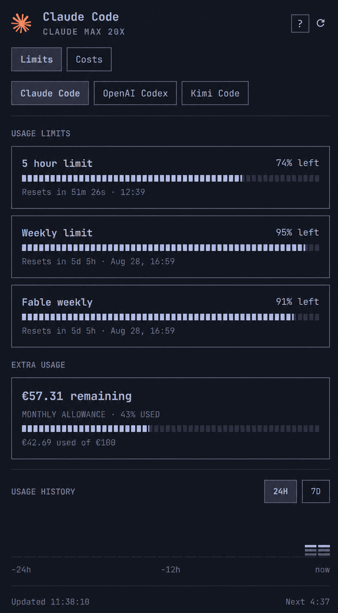

# Model Usage for Omarchy

[](https://github.com/DigitalPals/omarchy-modelusage/actions/workflows/ci.yml)

Native Omarchy Quattro quota and activity monitoring for Claude Code, OpenAI Codex, and Kimi Code. A compact bar widget opens a keyboard-friendly panel with provider limits, reset times, credits, persistent quota history, and on-demand API-equivalent cost estimates from local CLI transcripts.

<p align="center">
  
</p>

The screenshot reflects the shipped Quattro UI with representative usage data.

The panel follows Quattro's `Panel`, `KeyboardPanel`, hero, section, button, border, typography, spacing, focus, tooltip, and popup-coordination conventions. Quota and history visuals deliberately retain DigitalPals' fixed-block meter language.

## Compatibility

Developed and validated against Omarchy's `quattro` branch at commit [`2c247e390e357ae0fee3f8565b0c816adb705e6a`](https://github.com/basecamp/omarchy/commit/2c247e390e357ae0fee3f8565b0c816adb705e6a) (2026-08-22).

This plugin uses schema-v1 third-party bar-widget APIs from that revision. It does not patch Omarchy, install system files, or extend Omarchy's built-in agent collector directory.

See [COMPATIBILITY.md](COMPATIBILITY.md) for the tested runtime and provider CLI versions.

## Requirements

- Omarchy Quattro with schema-v1 third-party shell plugins.
- Python 3.10 or newer available as `python3`; the backends use only the standard library.
- At least one enabled provider CLI signed in with its normal login command.
- Network access to the selected providers for quota checks. Opening Costs may also fetch the public LiteLLM pricing table from GitHub once per day.

## Install

Review third-party plugin code before installing it; Omarchy plugins execute as your user inside the long-lived shell process.

```bash
omarchy plugin add https://github.com/DigitalPals/omarchy-modelusage.git --enable
```

Manage it later with:

```bash
omarchy plugin disable digitalpals.model-usage
omarchy plugin enable digitalpals.model-usage
omarchy plugin update digitalpals.model-usage
omarchy plugin remove digitalpals.model-usage
```

The built-in `omarchy.agents` plugin is neither changed nor disabled. Both can coexist. If you prefer this plugin as the only AI usage widget, disable the built-in yourself:

```bash
omarchy plugin disable omarchy.agents
```

## Providers and authentication

Model Usage is a monitor, not an authentication manager. Its backend code reads credentials already owned by each official CLI, performs read-only calls, and does not write authentication state. A provider CLI may continue managing its own credentials when it is started normally—for example, Codex owns the app-server process used for its account RPC.

| Provider | Usage source | Sign-in command |
|---|---|---|
| Claude Code | Claude OAuth usage endpoint, including structured/scoped limits and extra usage | `claude auth login` |
| OpenAI Codex | `codex app-server` account/rate-limit RPC in a read-only sandbox | `codex login` |
| Kimi Code | Kimi's current `/usages` and optional `/me` endpoints | `kimi login` |

Environment overrides owned by the CLIs are honored: `CLAUDE_CONFIG_DIR`, `CODEX_HOME`, `KIMI_CODE_HOME`, `KIMI_CODE_BASE_URL`, and `KIMI_SHARE_DIR`.

No access or refresh token is printed, copied into plugin state, or included in display errors. State is XDG-aware: the plugin directory uses mode `0700` and its files use `0600`.

```text
${XDG_STATE_HOME:-~/.local/state}/omarchy/model-usage/history.json
${XDG_STATE_HOME:-~/.local/state}/omarchy/model-usage/cost-scan-cache.json
${XDG_STATE_HOME:-~/.local/state}/omarchy/model-usage/cost-model-rates.json
```

`history.json` contains bounded quota percentages. The cost scan cache contains only timestamps, model names, token counters, reported cost values, and SHA-256 identifiers for transcript paths, sessions, and deduplication keys. It never contains prompts, responses, or tool output. The model-rate cache is a compact copy of public LiteLLM prices.

## What it shows

- An Omarchy-native provider hero with the subscription plan visible and account/source details in a help tooltip.
- Any number of normalized session, weekly, model-scoped, additional, and spend-control windows.
- Fixed blocks with a real partially filled boundary block, using Omarchy colors and scaling.
- Reset countdowns and useful absolute reset times.
- Claude/Kimi extra usage, Codex credit balances, and Codex reset-credit counts when exposed.
- Compact 24H and 7D history based on the binding active quota window (the highest used percentage); samples survive shell restarts.
- A separate Costs tab with 24H, 7D, and 30D API-equivalent estimates, token totals, cached-input savings, time charts, and provider/model breakdowns.
- Honest pricing coverage: unknown or offline pricing renders as unavailable, never as a fabricated `$0.00`.
- Clean missing, expired, HTTP, provider-rate-limit, timeout, malformed-data, and CLI-unavailable states.

A failure in one provider is isolated; healthy providers remain selectable and render normally.

### What “estimated cost” means

Costs are the approximate public API value of locally recorded tokens, not money charged to a Claude, ChatGPT, or Kimi subscription. Claude-reported transcript costs take precedence; other attributable models use LiteLLM's public input, output, cache-read, and cache-creation rates. Pricing is fetched at most daily and cached for offline use.

Claude and Codex transcripts contain enough historical model information for estimation. Kimi's `wire.jsonl` contains reliable token counters but not reliable historical model attribution, so Kimi is shown as token-only and unpriced instead of being guessed. Transcript scanning starts only when the Costs tab is opened with missing/stale data or explicitly refreshed.

## Interactions

- Left click: toggle the panel.
- Middle click: select the next enabled provider.
- Right click: intentionally unused; the plugin does not invent an unrelated action.
- `h` / `l` or Left / Right: select provider in Limits.
- `j` / `k` or Down / Up: scroll.
- `r` or Enter: refresh.
- `c`: open the Costs tab.
- `u`: return to the Limits tab.
- Tab / Shift+Tab: move to the neighboring bar panel through Omarchy's panel coordinator.
- Escape: close.

Namespaced IPC is available through the normal shell command:

```bash
omarchy-shell digitalpals.model-usage open
omarchy-shell digitalpals.model-usage close
omarchy-shell digitalpals.model-usage toggle
omarchy-shell digitalpals.model-usage refresh
omarchy-shell digitalpals.model-usage next
omarchy-shell digitalpals.model-usage limits
omarchy-shell digitalpals.model-usage costs
```

## Settings

Settings are declared in `manifest.json` and appear in Omarchy's bar-widget editor.

| Key | Default | Meaning |
|---|---:|---|
| `refreshIntervalSec` | `900` | Automatic refresh interval; clamped to 60–3600 seconds |
| `enabledProviders` | all three | Providers queried and displayed |
| `barDisplayMode` | `Icon` | `Icon` or compact `Percentages` |
| `warningThreshold` | `25` | Mark urgent at or below this percentage remaining |
| `criticalThreshold` | `10` | Critical threshold in percentage remaining |

Examples:

```bash
omarchy bar set digitalpals.model-usage refreshIntervalSec 300 --json
omarchy bar set digitalpals.model-usage enabledProviders '["claude", "codex"]' --json
omarchy bar set digitalpals.model-usage barDisplayMode Percentages
omarchy bar set digitalpals.model-usage warningThreshold 20 --json
omarchy bar set digitalpals.model-usage criticalThreshold 5 --json
```

`Percentages` renders one compact provider-logo chip per provider with meaningful limits, followed by its binding window's remaining percentage. Clicking a chip opens that provider directly. Left and right bars automatically fall back to the icon presentation so the widget does not become excessively tall.

## Architecture

- `Panel.qml` owns the injected bar widget, native popup, keyboard behavior, provider selection, error/credit/limit presentation, and namespaced IPC.
- `UsageBackend.qml` owns one bounded asynchronous Python process, coalesces duplicate refresh requests, applies the configured interval, and rejects malformed contract output.
- `scripts/usage-fetch.py` performs parallel, failure-isolated provider collection and emits the versioned provider-neutral contract documented in [docs/backend-contract.md](docs/backend-contract.md).
- `CostBackend.qml` owns an independent, on-demand transcript scan, keeps the last known-good result across malformed responses, and never changes quota polling.
- `scripts/cost-fetch.py` streams CLI JSONL, applies provider-specific deduplication, caches sanitized per-file usage records, prices attributable models, and emits [the estimated-cost contract](docs/cost-contract.md).
- `UsageCosts.qml` renders the metric/period controls, time chart, token mix, coverage notices, and provider/model breakdowns without parsing raw history in QML.
- `BlockMeter.qml` renders one track item per fixed block plus only the partial boundary fragment—there is no duplicate full-width fill layer.
- `UsageHistory.qml` receives small pre-bucketed arrays; large history files are never parsed in QML.

The packaged script and assets are found with `Qt.resolvedUrl`, so cloned plugins, symlinked development checkouts, and Omarchy's hot reload all use the plugin's actual source directory.

Polling never overlaps: a refresh requested while a collector is running is collapsed into one follow-up run. Provider requests, transcript scans, price downloads, and both QML processes have timeouts. The one-second countdown timer runs only while the panel is open, quota history is capped to seven days, and transcript cache retention is capped to 32 days for the longest 30-day view plus boundary slack.

## Development and testing

Validate everything available on the current machine:

```bash
OMARCHY_QUATTRO_PATH=/path/to/omarchy-quattro ./tests/run
```

The suite performs:

- Python syntax checks and fixture/contract tests on Python 3.10 through 3.14 in CI.
- Claude, Codex, and Kimi normalization tests, including multiple/scoped windows and credits.
- Claude/Codex/Kimi transcript parsing, repeat/fork deduplication, token accounting, pricing, partial/unavailable costs, and private cache tests.
- missing/expired credentials, HTTP errors, timeouts, rate limiting, malformed data, and provider-failure isolation.
- bounded XDG history persistence and corrupt-history recovery.
- JavaScript threshold and compact-percentage tests.
- `omarchy plugin validate` when available.
- `qmllint` against the supplied Quattro source tree.
- a live Quickshell entrypoint contract on Wayland, including dark/light palettes, unusual accents, changed font/spacing scales, partial block fill, and top/bottom/left/right bar states.
- a runtime-log scan for binding loops, assignment failures, JavaScript exceptions, and component load failures.

`qmllint` cannot resolve child properties of Omarchy's dynamic `QtObject` theme tokens, the injected `bar` object, or Quickshell's native `QProcess::ExitStatus` signal type from the supplied import tree. The harness disables those two warning categories, treats every other warning as a failure, and uses the live Quickshell contract as the authoritative compile/runtime check for the dynamic bindings.

When developing from a symlink below `~/.config/omarchy/plugins/`, saving any plugin file triggers Quattro's normal third-party-plugin hot reload.

Maintainers should follow the [release checklist](docs/releasing.md) before tagging a version.

## Troubleshooting

**The panel asks me to sign in.** Run the exact command displayed for that provider, then press `r`. This plugin will not repair credentials itself.

**Codex reports unavailable.** Confirm `codex` is on `PATH` and `codex login` succeeds. The collector uses current app-server RPC with `-s read-only -a never`; it does not call the older private web endpoint.

**Kimi does not appear.** Confirm `kimi login` has created `~/.kimi-code/credentials/kimi-code.json`, or set `KIMI_CODE_HOME` to the CLI's actual data directory.

**History is empty.** History begins after the first successful limit fetch. Errors are not recorded as zero usage.

**Costs are unavailable but tokens appear.** The transcript was readable but its historical model could not be matched to a price, or the LiteLLM table has never been downloaded successfully. Connect once and refresh, or use the Tokens metric; unknown prices are intentionally not displayed as zero.

**The first Costs scan is slower.** A cold scan streams recent transcript files. Later scans reuse a per-file size/mtime cache and normally parse only changed sessions.

**Kimi has no dollar estimate.** Current Kimi Code wire records expose token usage without reliable historical model identity. The plugin reports those tokens but will not invent a price.

**The backend cannot start.** Python 3.10 or newer must be available as `python3`. The backend uses only the Python standard library.

**I see two AI widgets.** `digitalpals.model-usage` and `omarchy.agents` are intentionally independent. Disable whichever one you do not want.

## License and attribution

The plugin is MIT licensed. See [LICENSE](LICENSE), [THIRD_PARTY_NOTICES.md](THIRD_PARTY_NOTICES.md), [CHANGELOG.md](CHANGELOG.md), and [SECURITY.md](SECURITY.md). Provider names and marks remain the property of their respective owners and do not imply endorsement.
